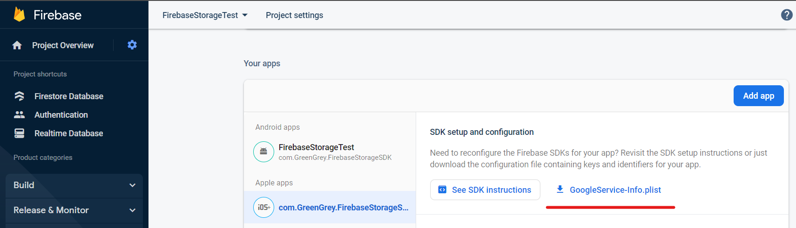

# GG Firebase Storage Documentation
Данная документация актуальна для версии библиотеки 1.0.0


## Интеграция
### Установка пакетов firebase
Перед интеграцией библиотеки необходимо установить в проект пакеты FirebaseAuth.unitypackage 
и FirebaseFirestore.unitypackage, следуя [официальному мануалу](https://firebase.google.com/docs/firestore/quickstart)

### Установка библиотеки GG Firebase Storage
Для установки библиотеки нужно открыть окно ***Package Manager`а*** (_Windows -> Package Manager_), 
нажать на плюс в левом верхнем углу окна и выбрать вариант ***Add Package from git URL...***


В открывшимся окне вводим адрес релизной версии сдк:
`https://github.com/GreenGreyStudioOfficial/gg-firebase-storage-release.git#1.0.0`

### Установка примеров использования библиотеки
Для быстрого ознакомления с работой библиотеки можно установить в проект настроенную сцену с примером работы с библиотекой.

Для этого в окне ***Package Manager`а*** выберете пакет библиотеки и импортируйте в проект необходимые примеры


Для работы библиотеки в целом и примера в частности необходимо выполнить настройку консоли Firebase


## Настройка консоли Firebase
### Создание проекта и добавление необходимых продуктов
В консоли Firebase создайте проект следуя [мануалу](https://firebase.google.com/docs/projects/learn-more) и добавьте в него приложения для Android и IOS, а также следующие продукты:
- Firestore Database (для хранения данных)
- Authentication (для авторизации пользователей)
- Realtime Database (для того, чтобы обойти баг Firebase. Без этого продукта в файлы google-services.json и GoogleService-Info.plist не попадут ключи базы данных firestore)


### Настройка доступов к базе данных
На данном шаге нужно настроить доступы к базе данных для обеспечения безопасности данных пользователей.

Для этого нужно перейти в настройки продукта Firestore Database, выбрать пункт Rules и ввести следующее правило:

```
service cloud.firestore {
  match /databases/{database}/documents {
    match /users/{userId} {
      allow read, update, delete: if request.auth != null && request.auth.uid == userId;
      allow create: if request.auth != null;
    }
  }
}
```


### Импорт конфигурационных файлов в юнити проект
После завершения всех настроек необходимо импортировать конфиги в юнити проект.

Сначала скачаем конфиги. Для этого надо зайти в настройки проекта Firebase и скачать файлы для каждого зарегистрированного приложения проекта




После этого нужно переместить скачанные файлы в проект юнити. Это был финальный шаг настройки консоли.


## Работа с библиотекой. Manual

Основной пайплайн работы с библиотекой выглядит следующим образом:
- Инициализация библиотеки
- Авторизация пользователя
- Загрузка данных с сервера
- Выгрызка данных на сервер

Все методы статичные и вызываются через обращение к классу `GgFirebaseStorage`.

Также в классе `GgFirebaseStorage` есть статический объект `apiEvents`, который содержет все события библиотеки.

### Инициализация библиотеки
Для инициализации библиотеки необходимо вызвать метод `public static bool TryInit(bool _isLogsEnable)` класса `GgFirebaseStorage`.

Метод возвращает true в случае успеха и false в случае провала.

На вход метод получает bool аргумент, влияющий на логгированние библиотеки. Рекомендуется устанавливать его в false в релизных сборках приложения.

До вызова метода инициализации остальные методы работать не будут. Кроме того, невозможно будет подписаться на события библиотеки.

Актуальное состояние инициализации можно проверить с помощью свойства `GgFirebaseStorage.isInitialised`.

### Авторизация пользователя
Для авторизации пользователя необходимо вызвать метод `public static void Authorise()` класса `GgFirebaseStorage`.

Как только авторизация закончится, библиотека вызовет событие `GgFirebaseStorage.apiEvents.AuthoriseCompleteEvent` при успехе и `GgFirebaseStorage.apiEvents.AuthoriseErrorEvent` при провале.

Делегат события `AuthoriseCompleteEvent` имеет следующую сигнатуру: `public delegate void AuthoriseCompleteDelegate(bool _isNewUser);`. 

Аргумент `_isNewUser` сообщает о наличии (значение false) или отсутствии (значение true) записи пользователя в базе данных.
Если пользователь отсутствует, то перед тем как загружать его данные, стоит выгрызить на сервер дефолтные данные игрока.

Делегат события `AuthoriseErrorEvent` имеет следующую сигнатуру: `public delegate void AuthoriseErrorDelegate(string _error);`, где аргумент `_error` - это текст ошибки.

До вызова метода авторизации, методы загрузки/выгрузки данных будут вызывать события ошибки.

Актуальное состояние авторизации можно проверить с помощью свойства `GgFirebaseStorage.isAuthorised`.

### Загрузка данных с сервера

Для загрузки данных пользователя необходимо вызвать метод `public static void LoadData()` класса `GgFirebaseStorage`.

Как только загрузка закончится, библиотека вызовет событие `GgFirebaseStorage.apiEvents.DataLoadedEvent` при успехе и `GgFirebaseStorage.apiEvents.DataLoadErrorEvent` при провале.

Делегат события `DataLoadedEvent` имеет следующую сигнатуру: `public delegate void DataLoadedDelegate(Dictionary<string, object> _data);`.

Аргумент `_data` - это словарь используемый в Firebase Firestore по умолчанию. Для более глубокого понимания формата данных можно 
ознакомиться с [официальной документацией](https://firebase.google.com/docs/firestore/manage-data/structure-data).

Для простоты мы рекомендуем хранить json текст в качестве значений словаря (как это сделано в примере)

Делегат события `DataLoadErrorEvent` имеет следующую сигнатуру: `public delegate void DataLoadErrorDelegate(string _error);`, где аргумент `_error` - это текст ошибки.

### Выгрызка данных на сервер

Для выгрузки данных пользователя необходимо вызвать метод `public static void UploadData(Dictionary<string, object> _data)` класса `GgFirebaseStorage`.

Аргумент `_data` - это словарь используемый в Firebase Firestore по умолчанию. Для более глубокого понимания формата данных можно
ознакомиться с [официальной документацией](https://firebase.google.com/docs/firestore/manage-data/structure-data).

Для простоты мы рекомендуем хранить json текст в качестве значений словаря (как это сделано в примере)

Как только загрузка закончится, библиотека вызовет событие `GgFirebaseStorage.apiEvents.DataUploadedEvent` при успехе и `GgFirebaseStorage.apiEvents.DataUploadErrorEvent` при провале.

Делегат события `DataUploadedEvent` имеет следующую сигнатуру: `public delegate void DataUploadedDelegate();`.

Делегат события `DataUploadErrorEvent` имеет следующую сигнатуру: `public delegate void DataUploadErrorEvent(string _error);`, где аргумент `_error` - это текст ошибки.

Данный метод можно имеет асинхронный вариант `public static async Task UploadDataAsync(Dictionary<string, object> _data)`, работающий аналогичным образом, но не вызывающий события библиотеки.
Он может быть полезен в тех ситуациях, когда нет возможности обработать событие завершения выгрузки (например при закрытии приложения).

### Удаление текущего пользователя с устройства

Для удаления текущего пользователя с устройства необходимо вызвать метод `public static async Task DeleteCurrentUser()` класса `GgFirebaseStorage`.

Этот метод добавлен с целью облегчить процесс дебага. 
При очистке кэша установленного приложения пользователь так же удалится.
Не рекомендуется применять его в релизных билдах.

Для быстрого удаления пользователя в эдиторе можно возпользоваться функцией _GreenGrey -> FirebaseStorage -> DeleteCurrentUser_

